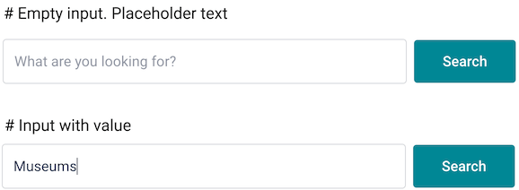

# Exercise 1: Search form

The purpose of the task is to implement the HTML (React) and CSS of a search form. The form looks like this:

We provide already a dumb component in `components/Search.js`. Right now it's a class component, but feel free to change it.

## Requirements

- The form doesn't need any behaviour. It just needs to show on the page
- Use plain CSS for the styles.

## Colors, Fonts, Sizes

- All fonts are `Roboto 16px` (imported for you already).
- The input and button are `50px` high.
- The width of the button should adapt to its content.
- The width of the input should adapt to the remaining space in the form.

| Element           | Color     |
| ----------------- | --------- |
| Input border      | `#D6D8DC` |
| Placeholder text  | `#ADB1BA` |
| Input text        | `#323C52` |
| Button background | `#018794` |
| Button color      | `#FFFFFF` |

## Things to consider

- The form must be responsive. It must adapt to the width of the container.
- Imagine we want to reuse the `<input />` and the `<button>` in other places. How would you make those two pieces reusable?
- Is a spec file needed for this task? If yes, what would you test in the spec? If no, why not?

I do not think we need to tests our components in this stage.
There is no user behavior at this first assignment. 