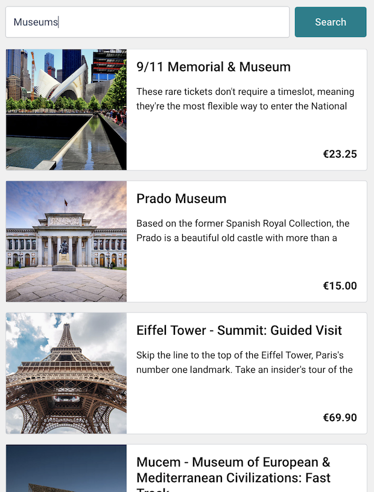

# Excercise 3: Search Results

The purpose of this task is to connect the search form and the API function of the previous tasks and render a list of search results below the form.

## Requirements

- The list updates when the user clicks on the button "Search", or they press the `Enter` key. The list **does not** update when the user types.
- Use plan CSS for the styles.
- The product summary must be limited to two lines.
- All prices are in EUR.

## Colors, Fonts, Sizes

- All texts are `#323C52`
- The border is `#D6D8DC`.
- The title is `font: 500 22px 'Roboto'`
- The summary is `font: 400 16px/1.5 'Roboto'`.
- The price is `font: 700 18px 'Roboto'`.
- All paddings and margings are `16px`.
- The images are `200px` square.

## Things to consider

- The product cards must be responsive. They should adapt to the width of the container.
- The user must be able to go to the product page. What parts should be clickable? Why?
- Should the product page open in a new page? Why? Why not?
