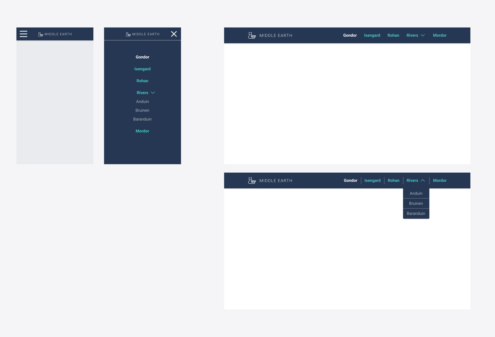

# Excercise 4: Navigation Menu

Implement the frontend code for rendering the navigation menu as specified below:

## Requirements

- Responsive:
	- The HTML markup should work for all viewports. The CSS should deal with changing the layout.
	- On small viewports, we show a _hambuger menu button_ that when clicked should open the navigation menu in full screen.
	- On bigger viewports, the navigation menu is shown by default, so no need to show the _hamburger menu button_.
- Expandable sub-menus: as shown in the design.
	- On the large-viewport version, the submenu should expand when hovering on the menu item.

## Things to consider

- Is scripting necessary to accomplish the responsive behaviour?
- Does it make sense to implement this with static HTML, or with React? Why?
- How would transitions or animations improve this implementation? Can you add them?
- At which viewport size should the responsive behaviour change? In other words, what should the media query breakpoint be? How do you decide that?
- The expanding sub-menus on hover can be done with CSS only, or with JS. Which one makes more sense here, and why?

## Getting it done

- Inside the `src` directory in this project's root, create a new folder named `nav-menu` with all the files related to this task.
- The writing for the _Things to consider_ section notes should be in a Markdown file inside the `nav-menu` folder.
- You're welcome to use any frontend resource you see fit to implement and complete this task.
